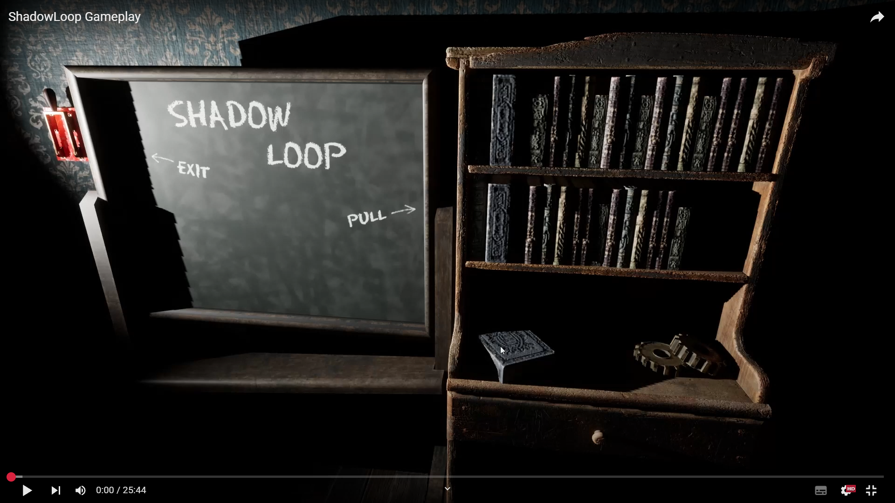

# Shadowloop

*You enter a room, you don’t know where you are and how you got there, everything looks ordinary… A dusty place with lamps shedding a dim light, old books, frames and strange items fill the place. 
A warm hope start spreading when you find a door to exit the place…*

*Your hope vanishes as you enter a room: everything looks ordinary, a dusty place with lamps shedding a dim light, old books, frames and strange items fill the place.*

*While you look around your instinct tells you, something else is in there.*
*The only way to get out?*
*Shadows, but the keys to break free poses the greatest threat*
*Something lurks in the shadows, something that might be scarier than staying here forever.*

*(Click on the image to open the video!)*

### Shadowloop is a firt-person horror puzzle game, the player is stuck in a loop and must find the right objects, place them in the correct places and find the correct rotation to solve puzzles and progress in the game.

It was developed during the online course in DBGA, in a team of three programmers and five game designers, simulating a real studio workflow with constraints and tight deadlines.

- My Role: Game Programmer
- Tools: C++, Blueprint
- Engine: Unreal Engine 5

I developed:
- The core mechanic of object interaction (pick up objects, carry them and rotate them)
- Input prompt (grab, release and rotation mode)
- Game over logic (after too much actions *something* can happen)

I also helped with the Enemy AI and polish/bug fixing

  

**_I can't share the complete project or source code for now, so i uploaded only my main contributions in this repository_**
